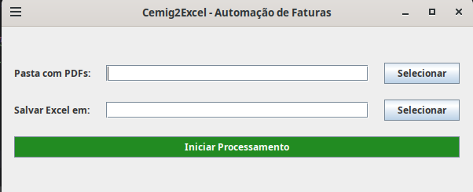

# Cemig2Excel - Extrator Automático de Faturas

Sistema de automação desenvolvido em Java para extração de dados de faturas de energia elétrica da CEMIG (PDF) e conversão para formato CSV/Excel. O projeto utiliza Expressões Regulares (Regex) de alta precisão para capturar dados financeiros, tributários e de geração distribuída (energia solar).

## 🚀 Funcionalidades

- **Processamento em Lote:** Lê e processa múltiplos arquivos PDF simultaneamente.
- **Regex Inteligente:** Extração de campos complexos como:
    - Número da Nota Fiscal e Série.
    - Datas de vencimento e emissão.
    - Valores decimais (Base de cálculo, Alíquotas, ICMS, PASEP, COFINS).
    - Saldo acumulado de geração distribuída (kWh, Wh, MWh) com suporte a quebra de linha.
    - Detalhamento de itens de fatura (Energia Elétrica, Encargos).
- **Interface Gráfica (Swing):** Tela intuitiva para seleção de diretórios de entrada e saída.
- **Logs de Auditoria:** Sistema de logs que registra falhas de leitura por arquivo e campo específico.
- **Cross-Platform:** Compatível com Windows e Linux (gerenciamento dinâmico de diretórios).

## 📁 Estrutura do Projeto

Conforme a arquitetura do sistema:

- `form`: Contém a `TelaProcessador.java` (Interface Gráfica).
- `layout`: Define o `BaseLayout.java` para mapeamento das regiões do PDF.
- `model`:
    - `Fatura.java`: Objeto de domínio que representa a fatura processada.
    - `FaturaBruta.java`: Representação dos dados crus extraídos.
- `util`:
    - `FaturaParser.java`: O "motor" de Regex do sistema.
    - `FaturaProcessor.java`: Orquestrador da leitura e fluxo de dados.
    - `ExcelExporter.java`: Gerador de arquivos CSV no padrão brasileiro (;).
    - `LogErro.java`: Gerenciador de logs de erro em pasta dedicada.
    - `LerPdfParser.java`: Utilitário para leitura de arquivos PDF.

## 🛠️ Tecnologias Utilizadas

- **Java 17+**
- **Regex (Java Utility Pattern/Matcher):** Para parseamento de strings.
- **Swing:** Para a interface de usuário.
- **Maven/NIO Path:** Para manipulação robusta de arquivos.

## ⚙️ Como Usar

1. Execute a classe `Main.java`.
2. Na tela que abrir, clique em **Selecionar** na "Pasta com PDFs" para escolher onde estão suas faturas.
3. O sistema sugerirá automaticamente uma pasta `/saida` no mesmo local.
4. Clique em **Iniciar Processamento**.
5. Ao final, o arquivo CSV será gerado com o nome baseado na data atual e quaisquer erros de leitura poderão ser consultados na pasta `/log`.

## 📝 Exemplo de Saída (CSV)
O arquivo gerado utiliza o delimitador `;` para abertura direta no Excel:
```csv
Nome Arquivo;Mês Ref;Vencimento;Valor a Pagar;Nº NF;Série;Emissão;Chave;...
fatura_abr_2026.pdf;04/2026;11/04/2025;165,37;251723252;000;...
```

**Imagem:** .